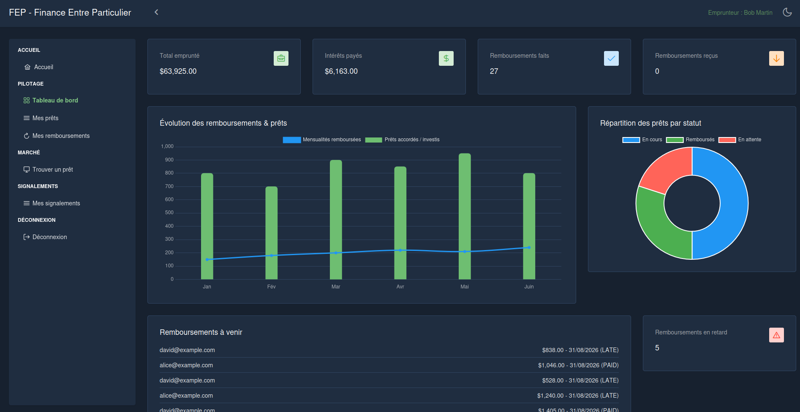
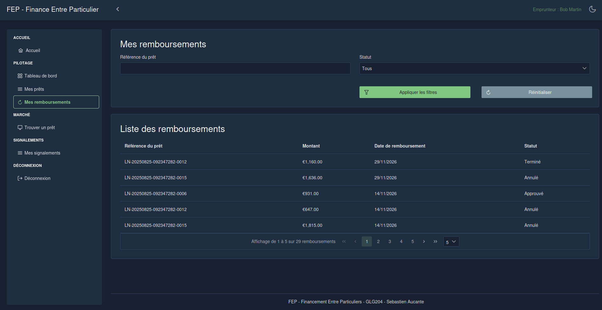

# FEP-UI

## FEP-UI requires FEP-API to be running.
### Running on port : 4200

> **Frontend (Angular) for the Peer-to-Peer Financing System (FEP).**

### Key Features
* **Loan Management:** Creation, tracking, and repayment of peer-to-peer loans
* **User Dashboard:** Synthetic overview of activity and finances
* **Reporting:** Generation of activity and repayment reports
* **Admin Back-Office:** Management of users and transactions
* **Authentication:** Login, registration, password management, and access control

---

### Architecture & Technical Choices
* **Modular Angular 17:** Domain-driven breakdown (`auth`, `loan`, `refund`, `report`, `dashboard`, `admin`)
* **PrimeNG + Angular Material:** Consistent UI with out-of-the-box components
* **REST API:** Communication with the backend via `HttpClient`, environment-configurable URL
* **Multi-Stage Docker Build:** Lightweight production image served by Nginx

---

### Quick Start

#### Prerequisites
* Docker & Docker Compose
* *(Optional) Node.js 20+*

#### Running with Docker
```bash
# Clone the repository
git clone https://github.com/saucante74/FEP-UI.git
cd FEP-UI

# Run the application
docker compose up -d --build
```

<p align="center">
  
  
</p>
<p align="center">
  
  </p>
<p align="center">
  
  
</p>

